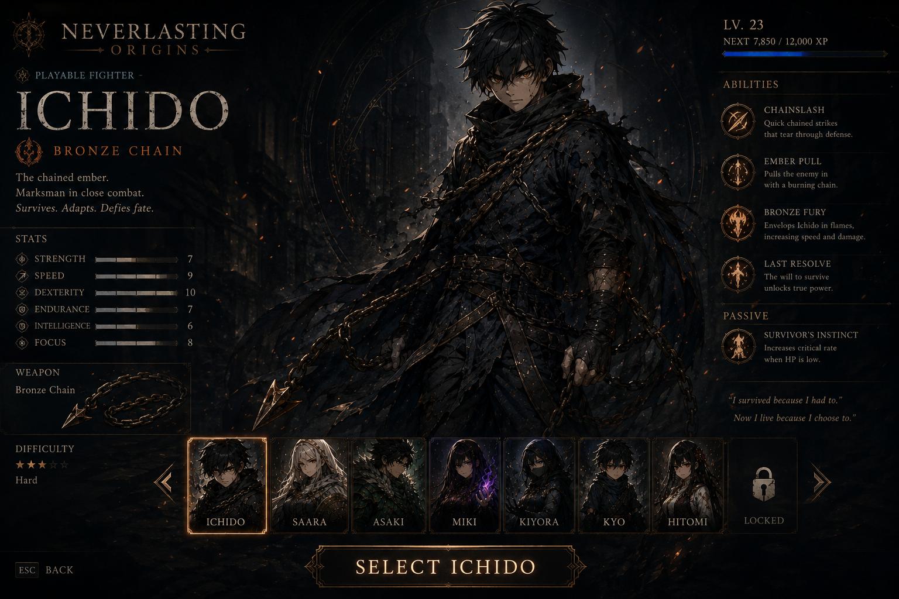
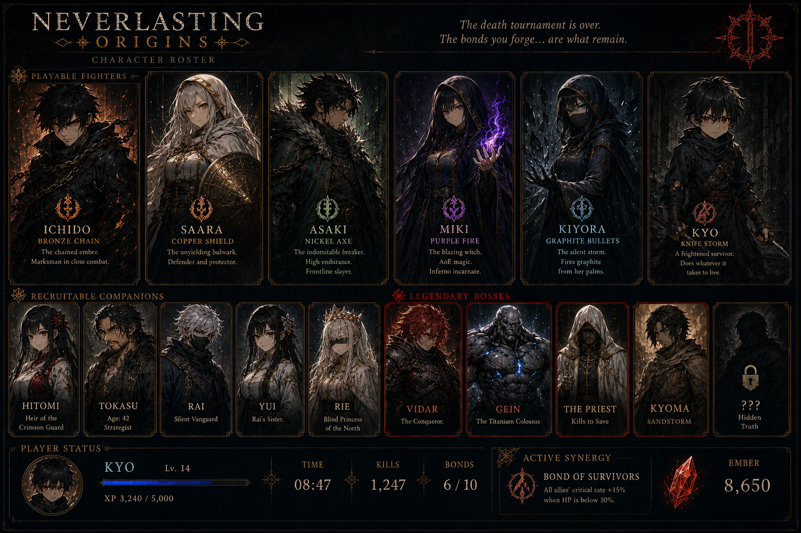
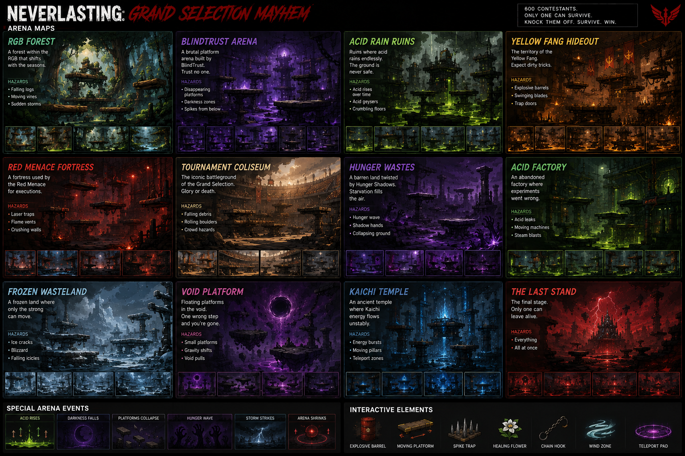

# NEVERLASTING: ORIGINS

> *The death tournament is over. The bonds you forge... are what remain.*

A dark fantasy bullet-heaven survival game set in the world of **Neverlasting**.

Play as survivors of the Grand Selection Tournament, recruit allies, forge powerful bonds, defeat legendary bosses, and uncover the secrets hidden within the Neverlasting universe.

---

# Screenshots

## Character Selection

Choose from a growing roster of unique fighters, each with their own abilities, weapons, passives, and ultimate skills.

### Playable Fighters

- Ichido — Bronze Chain
- Saara — Copper Shield
- Asaki — Nickel Axe
- Miki — Purple Fire
- Kiyora — Graphite Bullets
- Kyo — Knife Storm
- Hitomi — Heir of the Crimson Guard

---

## Bonds & Companions

Recruit companions during your run and unlock powerful synergies.

Examples include:

- Witchfire
- Bond of Survivors
- Guardian's Oath
- Silent Vanguard

The more allies you keep alive, the stronger your team becomes.

---

## Legendary Bosses

Fight iconic enemies from the Neverlasting universe.

### Known Bosses

- Vidar — The Conqueror
- Gein — The Titanium Colossus
- The Priest — Kills to Save
- Kirishima — The Devourer
- Hidden Truth

Every boss introduces unique attacks and mechanics.

---

## Arenas

Battle across dangerous locations.

### Current Maps

- RGB Forest
- Blindtrust Arena
- Acid Rain Ruins
- Yellow Fang Hideout
- Red Menace Fortress
- Hunger Wastes
- Kaichi Temple
- The Last Stand

Each arena features:

- Environmental hazards
- Random events
- Unique enemies
- Different strategies

---

# Features

## Survivor Gameplay

- Endless enemy waves
- Level-up progression
- Build customization
- Boss encounters
- Ultimate abilities
- Permanent upgrades

---

## Story Content

Experience events inspired by the Neverlasting novels.

Including:

- RGB
- Blindtrust
- Yellow Fang
- Red Menace
- The Grand Selection

---

## Companion System

Recruit allies during runs.

Protect them to unlock:

- Synergies
- Passive bonuses
- Unique interactions
- Powerful combinations

---

## Sanctuary Progression

Earn Embers during runs and spend them on permanent upgrades.

Upgrade:

- Health
- Damage
- Experience Gain
- Companion Strength
- Resource Gain
- Ultimate Recharge

---

## Codex

Unlock entries for:

- Fighters
- Companions
- Bosses
- Factions
- Lore

Discover more of the Neverlasting world with every run.

---

# Playable Fighters

| Fighter | Role |
|----------|----------|
| Ichido | Balanced Chain Fighter |
| Saara | Tank / Protector |
| Asaki | Frontline Bruiser |
| Miki | AoE Fire Mage |
| Kiyora | Long-Range Specialist |
| Kyo | Assassin |
| Hitomi | Tactical Support |

---

# Controls

## Keyboard

| Key | Action |
|------|--------|
| WASD | Move |
| Mouse | Aim |
| Left Click | Attack |
| Space | Ultimate |
| P | Pause |

---

# The World of Neverlasting

A world ruled by:

- Death Tournaments
- Kaichi Users
- Syndicates
- Ancient Powers
- Unbreakable Bonds

Only the strongest survive.

---

# Roadmap

### Planned Features

- Additional Story Chapters
- More Bosses
- More Companions
- Character Skins
- Expanded Codex
- New Arenas
- Additional Synergies
- Secret Characters
- Hidden Endings

---

# Play Online

### GitHub Pages

[https://sentakkuofficial.github.io/Neverlasting-Swarm-V5/](https://sentakkuofficial.github.io/Neverlasting-Swarm-V9/)

---

# About

Neverlasting: Origins is based on the Neverlasting novel series created by **Nasif Sufian**.

A story about survival, sacrifice, friendship, and the bonds that remain after everything else is lost.

---

# Quote

> **Survive. Gather Bonds. Defy KuroKaze.**

> *In the Grand Selection, there are no heroes. Only survivors.*

---

## License

This project and the Neverlasting universe are the intellectual property of Nasif Sufian.

All rights reserved.
